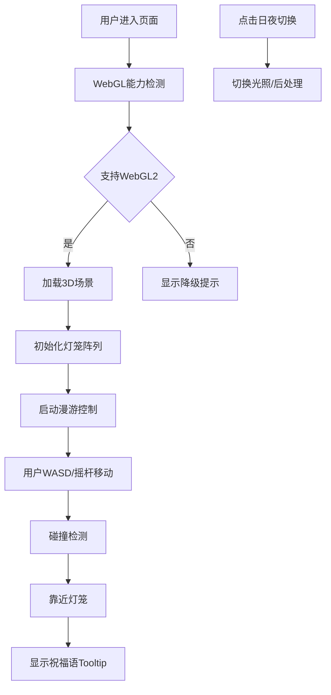

## 1. 产品概述

基于Three.js的3D互动灯笼长廊网页应用，复刻县城步行街节日灯笼景观，支持第一人称漫游体验。

- 核心目标：在浏览器中还原县城步行街节日灯笼景观，提供沉浸式漫游体验，让用户感受传统节日氛围。
- 目标用户：对3D互动体验感兴趣的用户，希望体验节日氛围的普通网民。
- 市场价值：将传统节日文化与现代Web技术结合，提供独特的文化传播载体。

## 2. 核心功能

### 2.1 用户角色

| 角色 | 注册方式 | 核心权限 |
|------|----------|----------|
| 访客用户 | 无需注册 | 自由漫游、查看祝福语、切换日夜模式 |

### 2.2 功能模块

1. **3D场景主页面**：灯笼长廊场景、漫游控制、日夜模式切换、性能监控

### 2.3 页面详情

| 页面名称 | 模块名称 | 功能描述 |
|----------|----------|--------------|
| 主场景页 | 3D街道场景 | 简模街道建筑、地面反射、两侧灯笼阵列 |
| 主场景页 | 灯笼系统 | InstancedMesh优化200+灯笼、点光源、随机间距分布 |
| 主场景页 | 漫游控制 | WASD键盘控制、触屏虚拟摇杆、第一人称视角 |
| 主场景页 | 交互系统 | 靠近灯笼显示Tooltip祝福语、JSON可编辑配置 |
| 主场景页 | 日夜模式 | 日/夜切换、夜间Bloom后处理效果 |
| 主场景页 | 性能监控 | FPS显示、WebGL能力检测 |

## 3. 核心流程

用户进入页面后，自动加载3D灯笼长廊场景，用户可以：
1. 使用WASD键或触屏摇杆在街道中漫游
2. 靠近灯笼时自动显示祝福语Tooltip
3. 点击日夜模式切换按钮切换场景氛围
4. 随时查看当前帧率和性能状态

## 4. 用户界面设计

### 4.1 设计风格

- **主色调**：中国红 (#C41E3A) 作为灯笼主色，金色 (#FFD700) 作为装饰色
- **日间**：暖色调天空，柔和自然光
- **夜间**：深蓝夜空，灯笼发出温暖红光
- **字体**：标题使用"Ma Shan Zheng"书法字体，正文使用"ZCOOL XiaoWei"字体，营造传统节日氛围
- **布局**：全屏3D场景，UI控件采用半透明浮动设计，不遮挡主场景
- **按钮样式**：圆角矩形按钮，悬停时有轻微发光效果

### 4.2 页面设计概述

| 页面名称 | 模块名称 | UI元素 |
|-----------|----------|---------|
| 主场景页 | 控制区 | 右上角日夜切换按钮、左上角FPS计数器、左下角移动提示、右下角触屏摇杆 |
| 主场景页 | Tooltip | 灯笼附近显示半透明卡片，包含祝福语，淡入淡出动画 |
| 主场景页 | 加载界面 | 传统风格加载动画，灯笼图标旋转 |

### 4.3 响应式设计

- **桌面端**：WASD键盘控制，鼠标视角控制
- **移动端**：触屏虚拟摇杆，触摸滑动视角
- **自适应**：根据设备性能自动调整渲染质量

### 4.4 3D场景指导

- **环境**：
  - 日间：淡蓝色天空，柔和方向光模拟太阳光，环境光提供基础照明
  - 夜间：深蓝色天空，星光点缀，灯笼点光源成为主要照明
- **光照设置**：
  - 日间：DirectionalLight + AmbientLight
  - 夜间：AmbientLight（低强度）+ 每个灯笼PointLight
- **相机设置**：
  - 第一人称视角，PerspectiveCamera，fov 75
  - 移动速度 5单位/秒，鼠标灵敏度 0.002
- **构图**：
  - 街道长度约200单位，宽度8单位
  - 灯笼悬挂高度3-4单位，间距2-4单位随机
  - 两侧建筑高度6-10单位随机
- **交互与动画**：
  - 灯笼轻微上下浮动动画
  - 灯笼光线强度呼吸效果
  - 相机移动时的轻微头部晃动
- **后处理效果**：
  - 夜间：BloomEffect（阈值0.4，强度1.5，半径0.5）
  - 可选：FXAA抗锯齿
- **资源来源与性能预算**：
  - 全部使用基础几何体（Box、Cylinder、Sphere）
  - 灯笼使用InstancedMesh，≥200个实例
  - 目标帧率≥30fps
