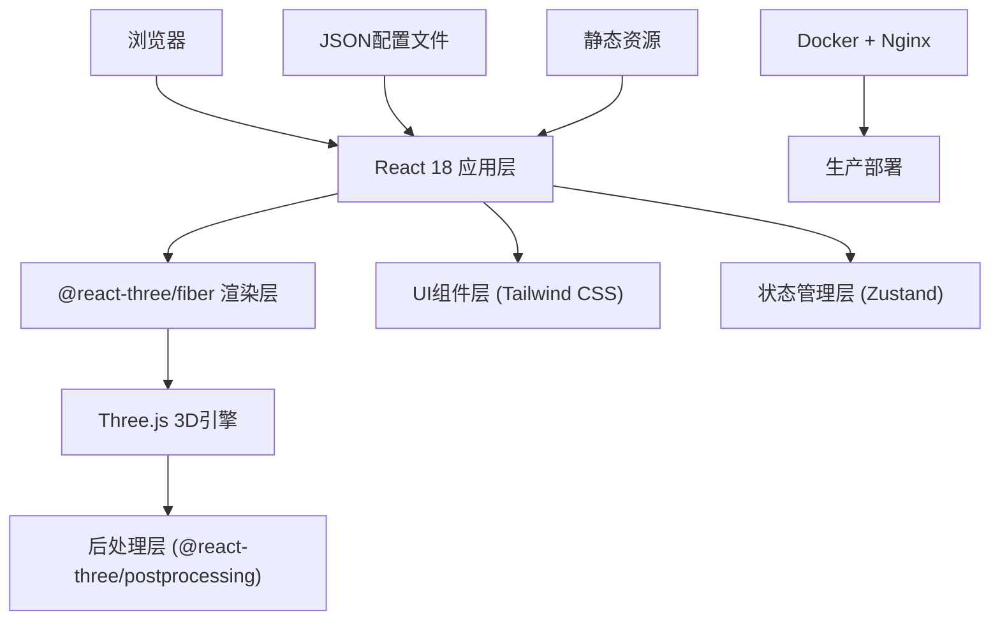

## 1. 架构设计



## 2. 技术描述

- **前端框架**：React 18 + TypeScript + Vite 6
- **3D引擎**：Three.js 0.160+
- **React-Three绑定**：@react-three/fiber 8.15+，@react-three/drei 9.92+
- **后处理**：@react-three/postprocessing 2.15+
- **样式方案**：Tailwind CSS 3.4
- **状态管理**：Zustand 5.0
- **图标库**：lucide-react 0.511+
- **部署方式**：Docker + Nginx

### 核心依赖说明
- `three`：WebGL 3D渲染引擎
- `@react-three/fiber`：Three.js的React渲染器
- `@react-three/drei`：Three.js常用组件库（相机控制、环境等）
- `@react-three/postprocessing`：后处理效果（Bloom、FXAA等）
- `zustand`：轻量级状态管理，存储日夜模式、性能状态

## 3. 路由定义

| 路由 | 用途 |
|------|------|
| / | 3D灯笼长廊主场景 |

## 4. 核心模块设计

### 4.1 目录结构

```
src/
├── components/
│   ├── LanternScene/       # 3D场景组件
│   │   ├── Street.tsx      # 街道建筑
│   │   ├── Lanterns.tsx    # 灯笼阵列（InstancedMesh）
│   │   └── Ground.tsx      # 地面反射
│   ├── UI/
│   │   ├── Controls.tsx    # 控制按钮（日夜切换）
│   │   ├── Joystick.tsx    # 触屏摇杆
│   │   ├── Tooltip.tsx     # 祝福语提示
│   │   └── FPSCounter.tsx  # 性能监控
│   └── LoadingScreen.tsx   # 加载界面
├── hooks/
│   ├── usePlayerControl.ts # 玩家控制
│   └── useLanternTooltip.ts # 灯笼提示检测
├── store/
│   └── useGameStore.ts     # 全局状态
├── config/
│   └── blessings.json      # 祝福语配置
├── types/
│   └── index.ts            # 类型定义
├── pages/
│   └── Home.tsx            # 主页面
└── App.tsx
```

### 4.2 关键实现方案

#### 4.2.1 灯笼InstancedMesh优化
- 使用 `THREE.InstancedMesh` 创建≥200个灯笼实例
- 每个灯笼由3部分组成：主体（Cylinder）、上下盖（Cone）、流苏（Cylinder）
- 使用 `InstancedBufferAttribute` 存储每个灯笼的颜色、动画相位
- 顶点着色器实现灯笼浮动和呼吸效果

#### 4.2.2 点光源优化
- 由于200+点光源性能开销大，采用以下策略：
  - 实际创建有限数量（16-32个）点光源
  - 采用"灯光池"机制，只照亮相机附近的灯笼
  - 远处灯笼使用自发光材质模拟发光效果

#### 4.2.3 地面反射
- 使用 `THREE.MeshStandardMaterial` 配合 `metalness` 和 `roughness` 属性
- 可选使用 `Reflector` 组件实现实时反射
- 移动端降级为静态反射贴图

#### 4.2.4 玩家控制
- 桌面端：WASD移动，PointerLock鼠标视角
- 移动端：虚拟摇杆移动，触摸滑动视角
- 使用 `useFrame` 每帧更新位置，简单AABB碰撞检测

#### 4.2.5 Tooltip检测
- 每帧计算相机与所有灯笼的距离
- 使用空间网格（Spatial Grid）优化距离检测性能
- 找到最近的灯笼（距离<3单位）显示其祝福语

#### 4.2.6 日夜模式切换
- 切换天空颜色、环境光强度、方向光强度
- 夜间模式启用Bloom后处理
- 灯笼点光源强度夜间增强，日间减弱

## 5. 性能优化策略

| 优化项 | 方案 | 预期收益 |
|--------|------|----------|
| 灯笼渲染 | InstancedMesh + 自定义着色器 | 减少Draw Call，200+灯笼仅需1个Draw Call |
| 点光源 | 灯光池 + 距离剔除 | 控制同时激活的光源数量≤32 |
| 碰撞检测 | 空间网格加速 | O(n) → O(1) 平均查询时间 |
| 后处理 | 仅夜间启用Bloom | 日间减少渲染开销 |
| 几何体 | 简化模型，低多边形 | 减少顶点处理压力 |
| 材质 | 合并材质，共享Uniform | 减少状态切换 |

## 6. 数据配置

### 6.1 祝福语配置 (blessings.json)

```json
{
  "blessings": [
    { "id": 1, "text": "新年快乐，万事如意！", "category": "festival" },
    { "id": 2, "text": "阖家团圆，幸福安康！", "category": "family" },
    { "id": 3, "text": "财源广进，步步高升！", "category": "career" },
    { "id": 4, "text": "身体健康，长命百岁！", "category": "health" },
    { "id": 5, "text": "学业有成，前程似锦！", "category": "study" }
  ]
}
```

### 6.2 场景配置 (sceneConfig.json)

```json
{
  "street": {
    "length": 200,
    "width": 8
  },
  "lanterns": {
    "count": 250,
    "minSpacing": 2,
    "maxSpacing": 4,
    "minHeight": 3,
    "maxHeight": 4
  },
  "player": {
    "speed": 5,
    "mouseSensitivity": 0.002
  },
  "tooltip": {
    "triggerDistance": 3
  }
}
```

## 7. Docker部署配置

### 7.1 Dockerfile

```dockerfile
FROM node:20-alpine AS builder
WORKDIR /app
COPY package*.json ./
RUN npm install
COPY . .
RUN npm run build

FROM nginx:alpine
COPY --from=builder /app/dist /usr/share/nginx/html
COPY nginx.conf /etc/nginx/nginx.conf
EXPOSE 80
CMD ["nginx", "-g", "daemon off;"]
```

### 7.2 docker-compose.yml

```yaml
version: '3.8'
services:
  lantern-gallery:
    build: .
    ports:
      - "8080:80"
    restart: unless-stopped
```

### 7.3 nginx.conf

```nginx
server {
    listen 80;
    server_name localhost;
    root /usr/share/nginx/html;
    index index.html;

    gzip on;
    gzip_types text/plain text/css application/json application/javascript text/xml application/xml image/svg+xml;

    location ~* \.(js|css|png|jpg|jpeg|gif|ico|svg|woff|woff2|ttf|eot)$ {
        expires 1y;
        add_header Cache-Control "public, immutable";
    }

    location / {
        try_files $uri $uri/ /index.html;
    }
}
```

## 8. WebGL最低要求

| 指标 | 最低要求 | 推荐配置 |
|------|----------|----------|
| WebGL版本 | WebGL 2.0 | WebGL 2.0 |
| 显卡 | 集成显卡（Intel UHD 620+） | 独立显卡（GTX 1050+） |
| 显存 | 512MB | 2GB+ |
| CPU | 双核2.0GHz | 四核2.5GHz+ |
| 内存 | 4GB | 8GB+ |
| 浏览器 | Chrome 90+ / Firefox 88+ / Safari 15+ | Chrome 120+ |

## 9. 性能验收标准

- **帧率要求**：桌面端≥60fps，移动端≥30fps
- **灯笼数量**：≥200个，使用InstancedMesh
- **加载时间**：首屏加载≤5s（4G环境）
- **内存占用**：≤500MB
- **电池影响**：移动端连续使用1小时耗电≤30%
